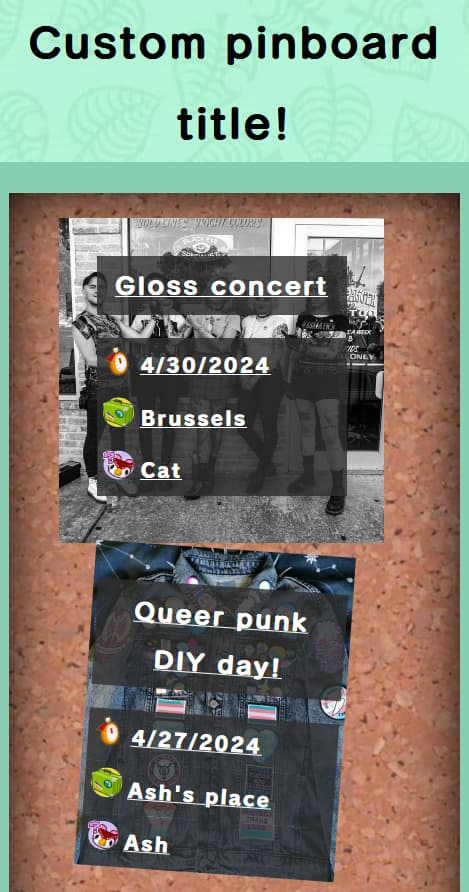

# Community Pinboard
[Repository](https://github.com/Denperidge/community-pinboard) - [Docker image](https://hub.docker.com/r/denperidge/community-pinboard) - [Development/bug tracker](https://github.com/Denperidge/community-pinboard/issues)

A public event pinboard webapp for your local community, meant to be even lighter on the client devices than on the server!




- To get this project up and running, you can view [How-to](#how-to)
- For the design decision behind this project, see [Explanation](#explanation)
- For technical info, see [Reference](#reference)

## How-to
### Run using Docker Compose
Recommended for: **production**

*Pre-requirements: [Docker](https://docs.docker.com/engine/install/), [Docker Compose](https://docs.docker.com/compose/install/#scenario-two-install-the-compose-plugin)*

1. Create `docker-compose.yml` with the following content:
    ```yml
    # docker-compose.yml
    services:
      community-pinboard:
        # Pull the Docker image from https://hub.docker.com/r/denperidge/community-pinboard
        image: denperidge/community-pinboard:latest
        volumes:
          - ./data/:/app/data  # Mount data directory in ./data
        ports:
          - 3000:3000  # Expose port 3000
        # Optionally, load environment variables from .env
        env_file:
          - path: .env
            required: false
    ```
2. Optionally, create a `.env` file to [configure environment variables](#environment-variables)
3. Run `docker compose up --detach`

You can now access the server from `localhost:3000`, and any pins & uploads in the `data/` directory


### Run using Docker
Recommended for: **production**

*Pre-requirements: [Docker](https://docs.docker.com/engine/install/)*

```bash
# Pull & run image
docker run -p 3000:3000 denperidge/community-pinboard:latest
```
You can now access the server from `localhost:3000`

*Note: this example does not automatically bind ./data to /app/data*


### Install and run using Node.js
Recommended for: **development**

*Pre-requirements: [Node.js](https://nodejs.org/en), [Yarn](https://yarnpkg.com/getting-started/install)*

```bash
# Clone the repository, navigate to it and install dependencies
git clone https://github.com/Denperidge/community-pinboard.git
cd community-pinboard
yarn install

yarn build  # Build to dist/
yarn prod  # Run from dist/
```
You can now access the server from `localhost:3000`, and any pins & uploads in the `data/` directory

(Alternative use `yarn dev` for live-reload development, or check the other scripts defined in [package.json](package.json))


### Build and run using Docker
Recommended for: **development**

*Pre-requirements: [Docker](https://docs.docker.com/engine/install/)*

```bash
# Clone the repository & navigate to it
git clone https://github.com/Denperidge/community-pinboard.git
cd community-pinboard
docker build -t community-pinboard .

# Run image
docker run -p 3000:3000 community-pinboard
```
You can now access the server from `localhost:3000`

*Note: this example does not automatically bind ./data to /app/data*


### Build and run using Docker-Compose
Recommended for: **development**

```bash
# Clone the repository & navigate to it
git clone https://github.com/Denperidge/community-pinboard.git
cd community-pinboard

# Build and run image
docker compose up --build
```
You can now access the server from `localhost:3000`, and any pins & uploads in the `data/` directory


### Configuration/environment variables
For customisation, please set the environment variables in your shell, docker-compose or a .env file in the root directory (the same directory this file, [README.md](README.md) is in)

For all configuration options, please refer to [Reference: Environment variables](#environment-variables).

## Explanation
### Base design decisions
This application was built to replace fragmented organising through multiple Facebook organisations, Discord servers and Whatsapp pinned messages. This means that by design, the systems built here have to go against this. Below are some of what I have found to be failings of the above tactics
- **Non-account-based:** Making new accounts feels like second nature to a good portion of the internets users, but it is a *hassle*, especially for those with less technological skills. *Whatsapp* circumvented this by using phone numbers, but it still requires an install, and it's still a product of Meta (a company known for an intrinsic disrespect to the privacy of its users). If authentication becomes an element, something simple should be used during pin creation/editing, but a full login and registering system is out of scope.
- **Lightweight:** Some apps like *Messenger*, *Facebook* and *Discord* or even some websites have forgotten that having your mobile phone isn't sending 500 requests and 20 animations simultaneously may slow down its performance. This website should be as streamlined as possible, and requires as little javascript as possible. All the heavy lifting - if any - should be done on the server side.
- **Easy setup & administration:** While you might need some technological know-how to get it Community Pinboard up and running at first, the server side is kept intentionally compact. The dependencies and devDepedencies in [package.json](package.json) should be split to ensure that the production version does not get overbloated. The decision to use a simple file-based hierarchy is also in support of this, so that file-based management can be done in case of mistakes or problems.
- **Cross-platform:** Everything has an app, but not everything should be. People barely get around to installing a calendar/scheduling app for people they live or work with, let alone this! A simple, clearview website.
- **Accessible:** Care should be put into the accessibility of the project. Mandatory image descriptions is a measure that - even though it might have to get a toggle down the line - an attempt at a step to making user-generated content more accessible, or at least thought about. Further care should also be put in providing as well-polished accessibility from the get-go.

### Timezone handling
#### Use cases
Datetime and timezones are relevant in the following parts of the application

Legend:
- 💚: UTC Value
- 🕒: Adjusted for timezone
- 🏠: Adjusted for locale

| Functionality | Should be displayed/passed as | Relevant files |
| ------------- | ----------------------------- | -------------- |
| View Pin date & datetime strings | 🕒🏠 | [Pin (pre)views](views/_pin.pug), [index page](views/index.pug) |
| Fill in edit form pin existing value | 🕒 | [form page](views/_form.pug), [form back-end](app/form.ts), [edit page](views/edit.pug), [edit routes](app/routes.edit.ts) |
| Read & write `data/pins/*.json` | 💚 | [Pin class](app/Pin.ts), [ICS feeds](app/routes.get.ts) |
| Add-To-Calendar-Button | 💚? TODO | [Pin class](app/Pin.ts), [Pin (pre)views](views/_pin.pug) |
| ICS feeds | TODO: double check | [Pin class](app/Pin.ts), [ICS Feed get routes](app/routes.get.ts) |

#### Pins
Every datetime stored in `data/pins/` is in **UTC**. See the [PinUTCDatetime class in app/Pin.ts](app/Pin.ts).
This was originally handled by saving and parsing from JavaScript's JSON.stringify, but [Javascript Date handling](#javascript-date) got the better of me.

This method of storing ensures a base certainty: the Pin class and JSON only contain **UTC**.


#### HTML Forms
For native `HTML` date(time) input, you have...
- `date` (which doesn't include time)
- `datetime-local` (which doesn't include timezone information)

No timezone-based `datetime` is available.
To ensure compatibility with more devices and lower client-side footprint, the native `datetime-local` input is used
(as opposed to a JS library solution).

- This returns **no timezone** information. The returned value is in the format of `YYYY-MM-DDTHH:MM`
- This means that the input values will be from the **users timezone point of view**


#### Javascript Date()
- `JavaScript Date()` also includes time
- Stored in **UTC**, specifically ms since January 1, 1970 00:00:00 UTC ([see w3schools](https://www.w3schools.com/js/js_dates.asp))
- I haven't have it gotten to consistently parse UTC strings *with* timezone information. This might be a goof on my end, though.
- `new Date().getTimezoneOffset()` is based on [TZ environment variable](#environment-variables).
- JavaScripts UTC constructor can deal with too many hours being provided. `new Date(Date.UTC(2024, 1, 1, 25, 0)).toISOString()` returns `"2024-02-02T01:00:00.000Z"`

#### Node.js
- `process.env.tz` Returns a `Area/City` format. See the [Node.js docs](https://nodejs.org/docs/v20.12.1/api/cli.html#tz) for more information

#### add-to-calendar-button
- Has `{start,end}Date` & `{start,end}Time`, both *seemingly* assuming the values to be **UTC**
- [timeZone config](https://add-to-calendar-button.com/configuration#event-parameters) 
  - This uses a library of the same developer for valid inputs for timeZone. See a few of the [available notations in the source code here](https://github.com/add2cal/timezones-ical-library/blob/308756344dc314a1499e298b9e99ad0377244c3e/src/zonesdb.js)
  - My best results were with using `Area/City`. This will be set in the `WEBSITE_TIMEZONE` [environment variable](#environment-variables)


## Reference
### Environment variables
| Key                 | Explanation | [default](app/conf.ts) | default (Docker) |
| ------------------- | ----------- | ------- | ---------------- |
| HOST_DOMAIN | Which domain the website/server will be reachable on | `localhost:3000` | not set |
| DATA_DIR | Where to store data uploaded by users | `data/` | `/app/data/` |
| WEBSITE_TITLE | The title for your website, displayed in HTML, OpenGraph, [views/index](views/index.pug) h1 | `Community Pinboard!` | not set |
| WEBSITE_DESCRIPTION | The description for your website, displayed in OpenGraph | `A public event pinboard for your local community!` | not set |
| **\*** WEBSITE_LOCALE | The locale for your website. This will determine in what format datetimes are displayed in the rendered HTML/within [app/Pin.ts](app/Pin.ts) | `en-BE` | not set |
| **\*** TZ | The timezone in `Area/City` notation (see `TZ identifier` on [Wikipedia list of database tz time zones](https://en.wikipedia.org/wiki/List_of_tz_database_time_zones#List)). This will determine in what timezone datetimes are added to calendar. Additionally, view the [`process.env.TZ` Node.js docs](https://nodejs.org/docs/v20.12.1/api/cli.html#tz) | `Europe/Brussels` | not set |
|||||
| `MAX_TITLE`       | Max character length for pin title | 80 | not set |
| `MAX_DESCRIPTION` | Max character length for pin description | 400 | not set |
| `MAX_LOCATION`    | Max character length for pin location | 150 | not set |
| `MAX_POSTEDBY`    | Max character length for pin posted by | 50 | not set |

*(**\***: recommended)*

For an example setup, see [.env.example](.env.example)

### Project structure
- [.github/workflows/](.github/workflows/): Worksflows that run on the CI/CD system of GitHub, [GitHub Actions](https://docs.github.com/en/actions). In this project it is used to deploy [Docker images](https://hub.docker.com/r/denperidge/community-pinboard)
- [app/](app/): Custom back-end code. Routing, saving pins to disk, the Pin class etc.
- [bin/](bin/): auto-generated by `express-generator`, used as entrypoint. Leave unmodified unless specifically required
- *data/*: auto-generated in runtime. Stores pin.json files, uploads... 
- [public/](public/): front-end assets that do not get processed. Client-side CSS/JS, fonts, images...
- [styles/](styles/): [scss](https://sass-lang.com/) files that will be transpiled to *public/stylesheets/style.css* (auto-generated in runtime)
- [views/](views/): front-end html templates, written in [Pug](https://pugjs.org/api/getting-started.html)
- [.dockerignore](.dockerignore): Which files are ignored by [Dockerfile](Dockerfile)
- [.gitignore](.gitignore): Which files are ignored by git/version control
- [app.ts](app.ts): auto-generated by `express-generator`. Ignore unless specifically required
- [docker-compose.yml](docker-compose.yml): file used to [build and run using Docker Compose](#build-and-run-using-docker-compose) 
- [Dockerfile](Dockerfile): file used to build a [Docker image](https://docs.docker.com/reference/dockerfile/)
- [LICENSE](LICENSE): license details.
- [package.json](package.json): package info. Stores startup scripts (`yarn start`), dependencies...
- [README.md](README.md): this file!
- [tsconfig.json](tsconfig.json): [TypeScript config file](https://www.typescriptlang.org/tsconfig)
- [yarn.lock](yarn.lock): auto-generated by yarn, updates when npm packages are added/removed

## Notice
The non-edited post-it SVG is from Openclipart, licensed under the Public Domain. [More information on the SVG can be found here](https://publicdomainvectors.org/en/free-clipart/Note-paper/44863.html).

The current (placeholder) background is from the [Nookipedia assets page](https://nookipedia.com/wiki/Nookipedia:Assets).

The cork.jpg material is...
- Created using `Cork001` from ambientCG.com,
  licensed under the Creative Commons CC0 1.0 Universal License.
- Modified by @hynet-mel.

## License
This project is licensed under the [MIT License](LICENSE).
